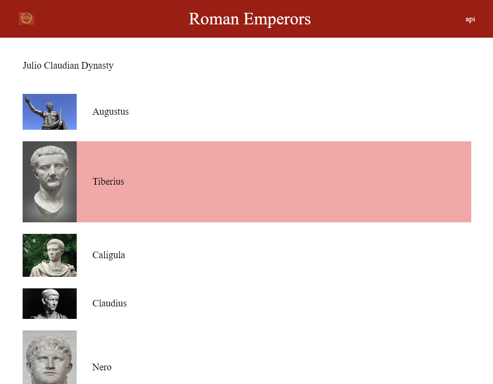
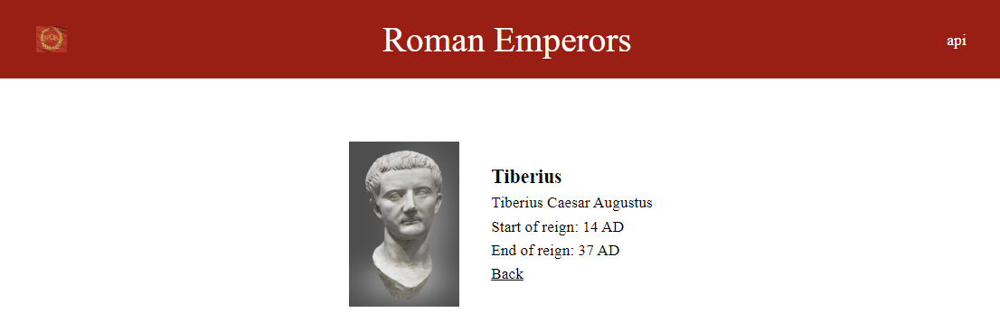
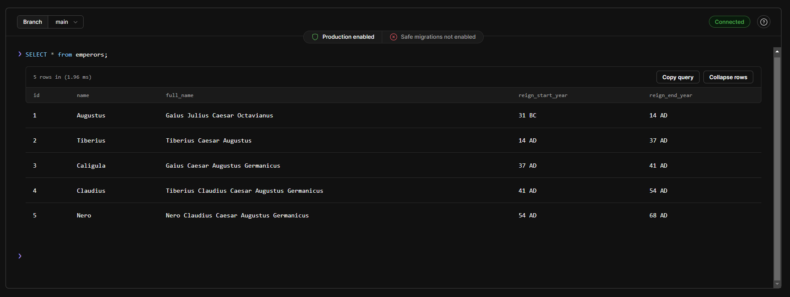

# Emperors

A full stack web app presenting Roman Emperors during the Julio Claudian Dynasty. This project is my introduction to the Flask framework and MySQL databases.

The home page lists the first emperors of the Roman Empire. Selecting an emperor takes the user to a page with more information about this emperor. 

The Flask app is hosted on [Render](https://render.com/) and is driven by a MySQL database hosted on [PlanetScale](https://planetscale.com/).

## Table of Contents

- [Demo](#Demo)
- [Technologies Used](#technologies-used)
- [Folder Structure](#folder-structure)
- [Author](#author)

## Demo
The project is hosted on render:
https://emperors-tkuh.onrender.com/

## Technologies Used

- Language: Python
- Framework: Flask
- Database: MySQL, MySQL Workbench, PlanetScale
- DB connection: sqlalchemy, mysql-connector-python
- Markup: HTML
- Styling: TailwindCSS
- Deployment: gunicorn, Render

## Folder Structure

    emperors/
      ├── app.py                # Main python file, flask routes
      ├── db.py                 # Create database connection and make queries 
      ├── templates/
             ├── index.html     # Home page
             ├── header.html    
             ├── footer.html   
             ├── emperor.html   # Page template with info for individual emperors
      ├── static/
          ├── images/           # Emperor images, favicon, and SPQR logo
          ├── output.css        # Tailwind-generated css file

## Author

Raphael
